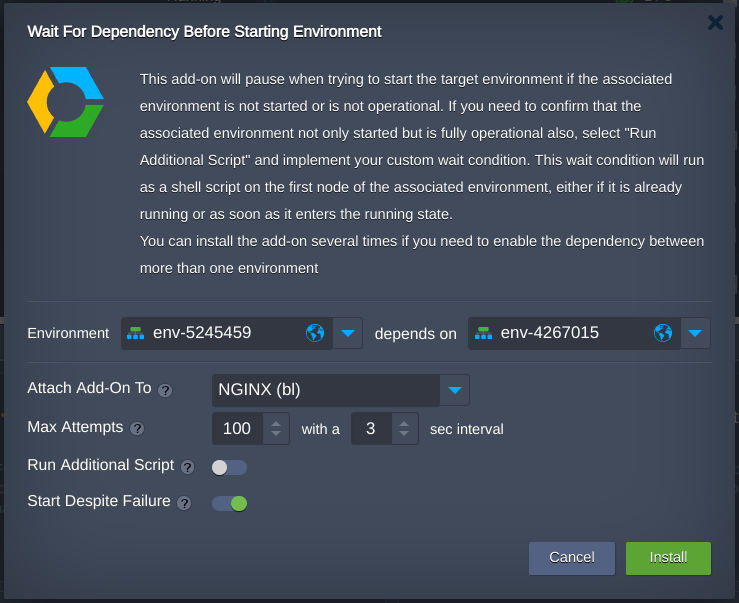
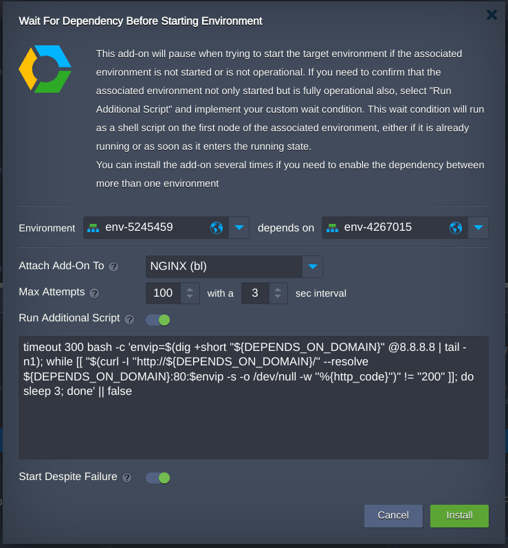
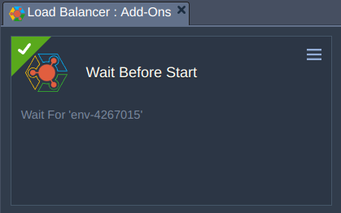
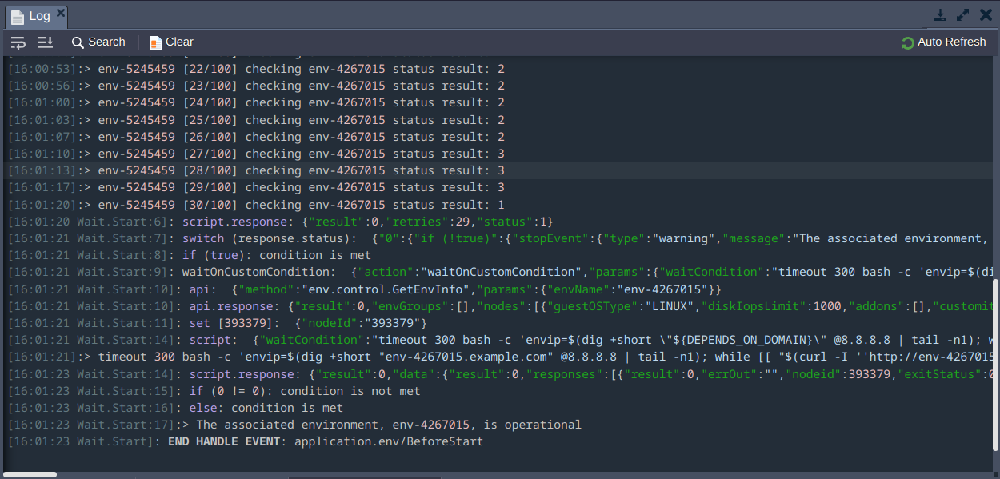
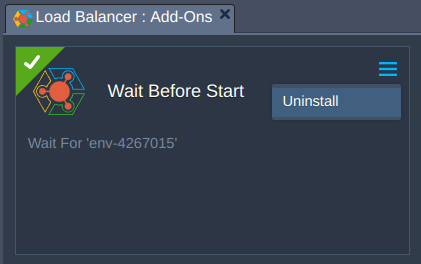

# Wait for Dependency Before Starting Environment

This add-on enables you to create a dependency between two environments. \
It will pause when trying to start the target environment if the associated environment is not started or is not operational.\
To enable multiple dependencies, the add-on can be installed several times for the same environment and node group.

## Installation Process

Import the [link of the add-on manifest](manifest.jps) within Virtuozzo Application Platform dashboard.

  **Note**: to access the dashboard you need to be registered at one of the [Virtuozzo Application Platform Cloud providers](https://www.virtuozzo.com/application-platform-partners/) or have a Private Cloud installation.

In the opened confirmation window:

  1. Choose the target environment and the environment it should depend on.
  2. Select the node group within the target environment to which the add-on should be attached.
  3. Specify the maximum number of attempts and the interval between checks for the status of the associated environment, if it is not running.
  4. If you need to confirm that the associated environment not only running but is fully operational also, select **Run Additional Script** and implement your custom wait condition. This wait condition will run as a shell script on the first node of the associated environment, either if it is already running or as soon as it enters the running state. The placeholder `${DEPENDS_ON_DOMAIN}` can be used to refer to the domain of the associated environment inside the script. The default value sets a 5-minute timeout to check that the associated environment responds from the external endpoint with an HTTP status code of 200.

  5. If you want to prevent the target environment from starting when all wait conditions have failed and the associated environment is non-operational, uncheck the **Start Despite Failure** option. The appropriate warning message will indicate the reason why the environment can't start. However, please note that disabling this option may prevent the target environment from running at all if the associated environment is deleted or broken. In such cases, use the [GetList](https://docs.jelastic.com/api/#!/api/marketplace.Installation-method-GetList) API to retrieve the add-on ID (appUniqueName), and then use the [Uninstall](https://docs.jelastic.com/api/#!/api/marketplace.Installation-method-Uninstall) API to remove the add-on.
  
  6. Upon completion of the installation, the installed add-on can be observed within the **Add-Ons** panel of the selected node group in the target environment.

## Testing and Troubleshooting

* To test the installed add-on:
  * Stop both environments.
  * Try to start the target environment and wait a minute. The starting process should not finish.
  * Start the associated environment. The starting process of the target environment should finish within a few seconds

* To view the add-on execution log and resolve potential issues,  navigate to **Import > JPS > View Logs** within Virtuozzo Application Platform dashboard.

* To uninstall the add-on, use the **Uninstall** action from the add-ons menu, or use the Uninstall API as described earlier in the step 5 of the installation process.

